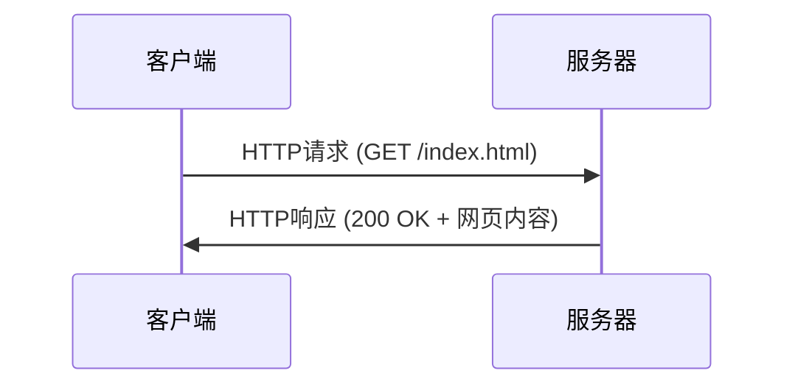
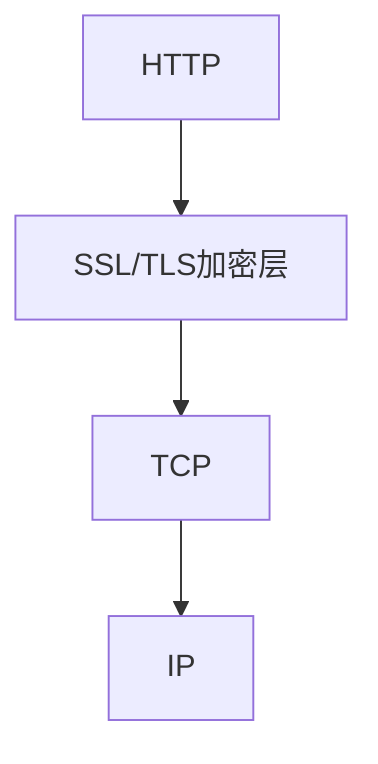
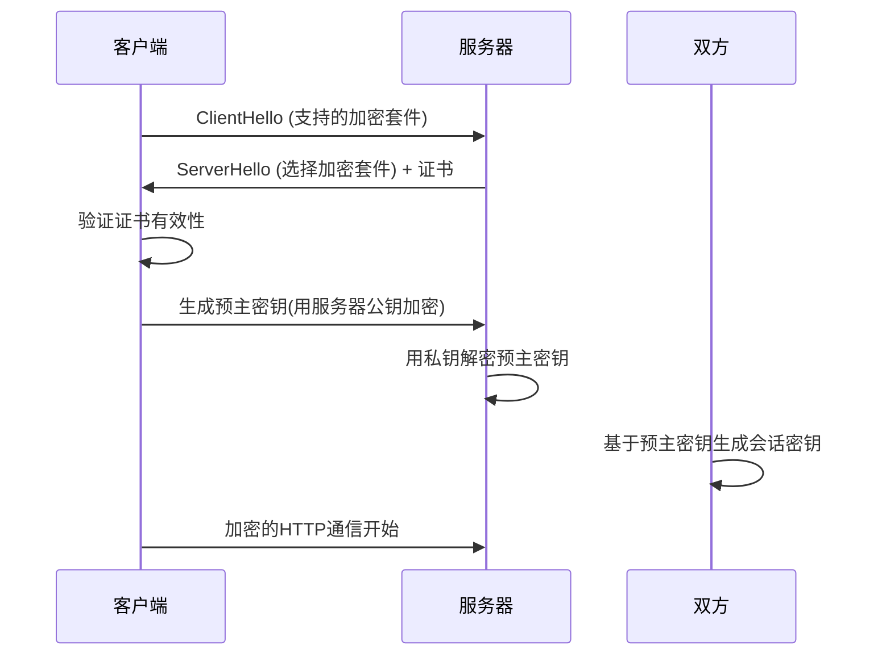

好的！**HTTP 和 HTTPS** 是我们每天上网都在使用的协议，是互联网应用的基石。让我为你全面解析这两个重要协议。

---

### 🎯 **核心概念速览**

**简单比喻**：
- **HTTP** = 寄送明信片 📮（内容谁都能看）
- **HTTPS** = 用保险箱寄信 🔒（加密保护）

---

### 📊 **HTTP/HTTPS 快速对比**

| 特性           | HTTP     | HTTPS            |
| -------------- | -------- | ---------------- |
| **安全性**     | 明文传输 | 加密传输         |
| **默认端口**   | 80       | 443              |
| **协议层**     | 应用层   | 应用层 + SSL/TLS |
| **证书**       | 不需要   | 需要数字证书     |
| **性能**       | 较快     | 稍慢（加密开销） |
| **SEO**        | 不利     | 谷歌优先排名     |
| **数据完整性** | 无保障   | 有完整性校验     |

---

### 🔍 **HTTP 协议详解**

#### **HTTP 工作原理**


#### **HTTP 请求结构**
```http
GET /index.html HTTP/1.1
Host: www.example.com
User-Agent: Mozilla/5.0
Accept: text/html
Connection: keep-alive
```

#### **HTTP 响应结构**
```http
HTTP/1.1 200 OK
Content-Type: text/html
Content-Length: 1256
Server: nginx/1.18.0

<!DOCTYPE html>
<html>
...
</html>
```

#### **常见 HTTP 方法**
```bash
GET     # 获取资源
POST    # 提交数据
PUT     # 更新资源
DELETE  # 删除资源
HEAD    # 获取头部信息
PATCH   # 部分更新
```

#### **重要 HTTP 状态码**
```bash
# 2xx 成功
200 OK - 请求成功
201 Created - 资源创建成功

# 3xx 重定向  
301 Moved Permanently - 永久重定向
302 Found - 临时重定向
304 Not Modified - 缓存有效

# 4xx 客户端错误
400 Bad Request - 请求错误
401 Unauthorized - 未认证
403 Forbidden - 禁止访问
404 Not Found - 资源不存在

# 5xx 服务器错误
500 Internal Server Error - 服务器内部错误
502 Bad Gateway - 网关错误
503 Service Unavailable - 服务不可用
```

---

### 🔒 **HTTPS 协议深度解析**

#### **HTTPS = HTTP + SSL/TLS**


#### **HTTPS 握手过程**


#### **证书验证过程**
```bash
# 证书链验证：
浏览器证书 → 中间CA证书 → 根CA证书

# 检查项目：
1. 证书是否在有效期内
2. 证书域名是否匹配
3. 证书颁发机构是否受信任
4. 证书是否被吊销
```

---

### 🛠️ **HTTP/HTTPS 实战操作**

#### **使用 curl 测试 HTTP**
```bash
# 基本请求
curl http://example.com

# 显示详细头部信息
curl -I http://example.com

# 跟随重定向
curl -L http://example.com

# 发送POST请求
curl -X POST -d "name=value" http://example.com/api

# 设置请求头
curl -H "Content-Type: application/json" http://api.example.com
```

#### **使用 openssl 测试 HTTPS**
```bash
# 检查证书信息
openssl s_client -connect example.com:443 -servername example.com

# 检查证书有效期
openssl s_client -connect example.com:443 2>/dev/null | openssl x509 -noout -dates

# 测试特定协议版本
openssl s_client -connect example.com:443 -tls1_2
```

#### **浏览器开发者工具分析**
```bash
# 在浏览器中按F12，查看：
1. Network标签 - 所有网络请求
2. Security标签 - 证书和加密信息
3. Headers - 请求和响应头部
4. Timing - 请求时间分析
```

---

### 🔧 **协议检测与调试**

#### **查看网站协议信息**
```bash
# 检查是否支持HTTPS
curl -I https://example.com

# 测试HTTP到HTTPS的重定向
curl -I http://example.com

# 检查HSTS头
curl -I https://example.com | grep -i strict-transport-security
```

#### **SSL/TLS 安全检查**
```bash
# 使用nmap扫描
nmap --script ssl-enum-ciphers -p 443 example.com

# 在线工具检查
# 访问: ssllabs.com/ssltest
```

---

### 📈 **HTTP/2 和 HTTP/3**

#### **HTTP/2 改进**
```bash
# 主要特性：
1. 二进制分帧 - 提高解析效率
2. 多路复用 - 一个连接并行多个请求
3. 头部压缩 - 减少开销
4. 服务器推送 - 主动推送资源

# 检查是否支持HTTP/2
curl -I --http2 https://example.com
```

#### **HTTP/3 (基于QUIC)**
```bash
# 基于UDP的HTTP
优点：更快的连接建立，更好的移动网络支持
现状：逐渐普及中
```

---

### 🚀 **性能优化实践**

#### **HTTP 优化技巧**
```bash
# 1. 启用压缩
Accept-Encoding: gzip, deflate, br

# 2. 使用缓存
Cache-Control: max-age=3600
ETag: "xyz123"

# 3. 减少重定向
# 4. 使用CDN加速
# 5. 资源合并和压缩
```

#### **HTTPS 优化技巧**
```bash
# 1. 会话恢复
# 2. OCSP Stapling
# 3. 启用HTTP/2
# 4. 优化证书链
# 5. 选择高效加密套件
```

---

### 🔍 **安全配置最佳实践**

#### **服务器安全头设置**
```nginx
# Nginx配置示例
add_header Strict-Transport-Security "max-age=31536000; includeSubDomains";
add_header X-Content-Type-Options nosniff;
add_header X-Frame-Options DENY;
add_header X-XSS-Protection "1; mode=block";
add_header Content-Security-Policy "default-src 'self'";
```

#### **TLS 配置优化**
```nginx
# 安全的SSL配置
ssl_protocols TLSv1.2 TLSv1.3;
ssl_ciphers ECDHE-RSA-AES128-GCM-SHA256:ECDHE-RSA-AES256-GCM-SHA384;
ssl_prefer_server_ciphers off;
ssl_session_cache shared:SSL:10m;
ssl_session_timeout 10m;
```

---

### 🌐 **实际应用场景**

#### **Web 开发中的使用**
```javascript
// 前端发起HTTP请求
fetch('https://api.example.com/data', {
    method: 'GET',
    headers: {
        'Content-Type': 'application/json',
    }
})
.then(response => response.json())
.then(data => console.log(data));

// 检查协议
if (window.location.protocol === 'https:') {
    console.log('安全连接');
}
```

#### **API 设计最佳实践**
```bash
# RESTful API设计
GET    /api/users       # 获取用户列表
POST   /api/users       # 创建用户
GET    /api/users/1     # 获取特定用户
PUT    /api/users/1     # 更新用户
DELETE /api/users/1     # 删除用户
```

---

### ⚠️ **常见问题排查**

#### **混合内容问题**
```bash
# HTTPS页面加载HTTP资源 - 浏览器会阻止
解决方案：所有资源都使用HTTPS
```

#### **证书问题**
```bash
# 常见证书错误：
1. 证书过期
2. 域名不匹配
3. 证书链不完整
4. 使用自签名证书
```

#### **性能问题**
```bash
# HTTPS性能优化：
1. 启用会话恢复
2. 使用OCSP Stapling
3. 优化证书链
4. 选择高效加密算法
```

---

### 📚 **协议发展历程**

```
1989: HTTP 0.9诞生
1996: HTTP 1.0标准化
1997: HTTP 1.1 (当前主流)
2000s: HTTPS开始普及
2015: HTTP/2发布
2022: HTTP/3逐渐成熟
```

---

### 💡 **现代Web开发建议**

#### **必须使用HTTPS的情况**
```bash
✅ 用户登录和认证
✅ 支付交易页面
✅ 个人隐私数据
✅ PWA渐进式网页应用
✅ 需要调用某些Web API
```

#### **开发环境配置**
```bash
# 本地开发使用HTTPS
# 生成自签名证书
openssl req -x509 -newkey rsa:4096 -keyout key.pem -out cert.pem -days 365

# 开发服务器配置
npm install --save-dev https-localhost
```

---

### 🎯 **总结**

**关键要点**：

1. **HTTP是基础，HTTPS是安全增强**
2. **现代Web必须使用HTTPS**
3. **理解状态码和头部是调试基础**
4. **性能优化需要多层面考虑**
5. **安全配置同样重要**

**行动建议**：
- 所有生产网站启用HTTPS
- 定期检查SSL证书状态
- 监控网站性能指标
- 关注HTTP/2和HTTP/3发展

现在你已经全面了解了HTTP和HTTPS协议！这些知识对于Web开发、运维和安全都至关重要。😊

需要我详细解释某个特定的应用场景吗？